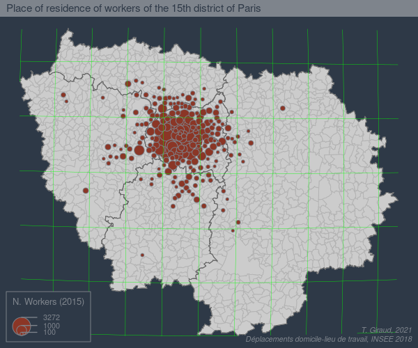
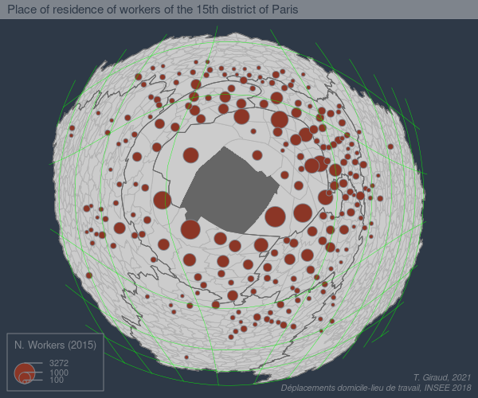

```{r setup, include=FALSE}
knitr::opts_chunk$set(echo = TRUE)
```

## Package Install

```{r, eval = F}
remotes::install_github("riatelab/fisheye")
```


## Data Preparation

```{r, eval = F}
library(sf)
library(fisheye)
library(mapsf)
# Import municipalities
com <- st_read("data/mob.gpkg", layer = "com")
# Import departments
dep <- st_read("data/mob.gpkg", layer = "dep")

# Create graticules
bb <- st_bbox(st_transform(com, 4326))
graw <- st_graticule(lon = seq(bb[1], bb[3], by = .2),
                     lat = seq(bb[2], bb[4], by = .2 ),
                     ndiscr = 10000)
g <- st_transform(graw, 2154)
g <- st_crop(g, com)
g <- st_collection_extract(g, "LINESTRING")
```

## Single Images

```{r, eval = F}
# transformation center
target <- com[com$INSEE_COM == 75115,]
# transformation intensity parameter
k <- seq(6,3,by = -.03)

for(i in 1:length(k)){
  # transform graticules
  gfe <- fisheye(g, centre = target, method = 'log', k = k[i])
  # transform municipalities
  comfe <- fisheye(com, centre = target, method = 'log', k = k[i])
  # trnasform departments
  depfe <- fisheye(dep, centre = target, method = 'log', k = k[i])
  # create theme
  th <- mf_theme("dark", mar = c(0,0,.9,0), line = .9, cex = .7)
  # export map
  mf_export(comfe, filename = sprintf("img/img%06d.png", i),
            width = 600, height = 500, res = 130, theme = th)
  mf_map(comfe, border = "grey70")
  mf_map(depfe, border = "grey40", col = NA, lwd = .7, add = T)
  mf_map(comfe[comfe$INSEE_COM==75115,], col = "grey40", border = NA, add = T)
  mf_map(comfe, "NBFLUX_C15_ACTOCC15P", "prop", inches = .1, leg_pos = NA)
  mf_map(gfe, col = c('green'),lwd = .3, add = T)
  mf_legend(type = "prop", pos = "bottomleft", val = c(100, 1000, 3272),
            inches = .1, title = "N. Workers (2015)", title_cex = .6,
            val_cex = .5, frame = T)
  mf_title("Place of residence of workers of the 15th district of Paris")
  mf_credits("T. Giraud, 2021\nDéplacements domicile-lieu de travail, INSEE 2018",
             cex = .5, pos = "bottomright")
  dev.off()
}

```

<table>
  <thead>
    <tr class="header">
      <th><p>From</p><p></p></th>
      <th><p>To</p><p></p></th>
    </tr>
  </thead>
</table>

## Gif Creation

```{r, eval = F}
# create gif
library(magick)
# list file names and read in
imgs <- list.files("img/", full.names = TRUE)[-101]
img_list <- lapply(imgs, image_read)

## join the images together
img_joined <- image_join(c(img_list, rev(img_list)))

## animate at 25 frames per second
img_animated <- image_animate(img_joined, fps = 25)

## Save animated image
image_write(image = img_animated, path = "gif/mob.gif")
```


